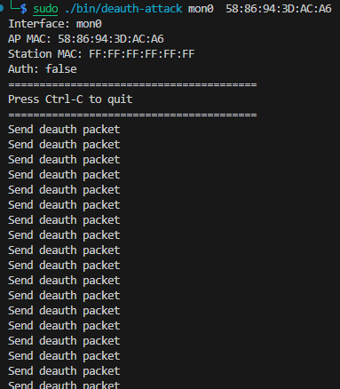

# report deauth attack

> [!CAUTION]
> 악용에 대한 책임을 지지 않습니다

## 과제
Deauth Attack 프로그램을 작성하라

## 실행
```sh
syntax : deauth-attack <interface> <ap mac> [<station mac> [-auth]]
sample : deauth-attack mon0 00:11:22:33:44:55 66:77:88:99:AA:BB
```

## 결과



## 상세
상세


- aireplay-ng 명령어를 이용하여 AP broadcast, AP unicast, Station unicast 패킷을 잡아서 어떠한 형태로 deauth frame이 발생하는지 파악한다.

```
aireplay-ng <interface> -a <ap mac> [-c <station mac>]
```

- <ap mac>만 명시되는 경우에는 AP broadcast frame을 발생시킨다.
- <station mac>까지 명시되는 경우에는 AP unicast, Station unicast frame을 발생시킨다.
- -auth 옵션이 주어지면 deauthentication이 아닌 authentication으로 공격한다(authentication frame 정보는 실제 일반 Station의 연결 과정에서 획득할 수 있다).
- 너무 많은 패킷을 발생시키면 무선 네트워크 사용에 지장을 줄 수 있으므로 적당히 sleep을 넣어 준다.

## 기타
- git에는 소스 코드(h, c, cpp)만 올리지 말고 프로젝트 파일(Makefile 혹은 *.pro)도 같이 올릴 것.
- 메일에는 코드 파일을 첨부하지 말고 git 주소만 알려줄 것.
